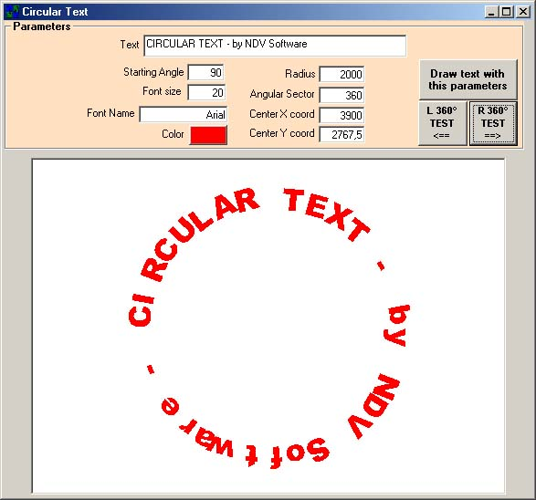



## Circular Text \(English Version\)

### Description

This example demostrate how is possible to write

a circular or arc text in a picture or in a Printer object.

It's possible to change all the parameters like radius, font, color, sector and

many others.
 
### More Info
 

             |
---                |---
**Submitted On**   |2001-05-14 13:36:20
**By**             |[NDV](https://github.com/Planet-Source-Code/PSCIndex/blob/master/ByAuthor/ndv.md)
**Level**          |Advanced
**User Rating**    |4.4 (35 globes from 8 users)
**Compatibility**  |VB 4\.0 \(16\-bit\), VB 4\.0 \(32\-bit\), VB 5\.0, VB 6\.0
**Category**       |[Graphics](https://github.com/Planet-Source-Code/PSCIndex/blob/master/ByCategory/graphics__1-46.md)
**World**          |[Visual Basic](https://github.com/Planet-Source-Code/PSCIndex/blob/master/ByWorld/visual-basic.md)
**Archive File**   |[Circular T196105142001\.zip](https://github.com/Planet-Source-Code/ndv-circular-text-english-version__1-23174/archive/master.zip)

